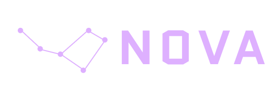
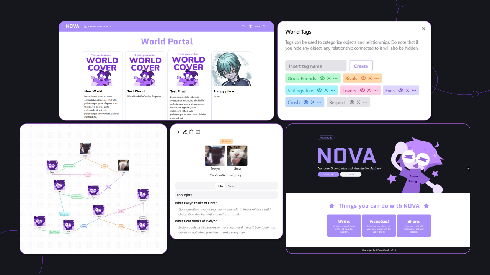

    <picture>
      <source media="(prefers-color-scheme: dark)"
          srcset="./public/Logo.png"
          width="550"
          height="190"
      />
      <source media="(prefers-color-scheme: light)"
          srcset="./public/logo-light.png"
          width="550"
          height="190"
      />
      
    </picture>

  Narrative Organization and Visualization Assistant
  

      </td>

# Introducing, NOVA 🌠
A web application that helps writer create graph visualization for their narrative entities (characters, objects, locations, etc) in collaborative worldbuilding projects

## Table of Contents
- [Features](#features)
- [How do I use it?](#howtouse)
- [Tech stack](#techstack)
- [Contributors](#contributors)
- [License](#license)
  
## Features

* **Graph Visualization:** A drag and drop graph visualization creator
* **Entity Details:**  Write stories and your character's profile and thoughts
* **Tagging System:**  Give tags to your objects and filter based the tags it has! You can choose which tag to show on the graph 
* **Collaborate** Invite other users to collaborate on your fictional world

## How do I use it?

Currently, NOVA is still under development. However, you can check out the newest build [HERE](https://nova-staging.vercel.app/)

## Tech stack

- **NextJS**: The core framework for building this project
- **MongoDB**: Database chosen for this project
- **Shadcn**: Library used to create UI for this project
- **ReactFlow**: A library that helps the implementation of NOVA's graph visualization

## Contributors

|  
| :---: |
| [Aulia Nadhirah Y. B.](https://github.com/Aulianyb)|
